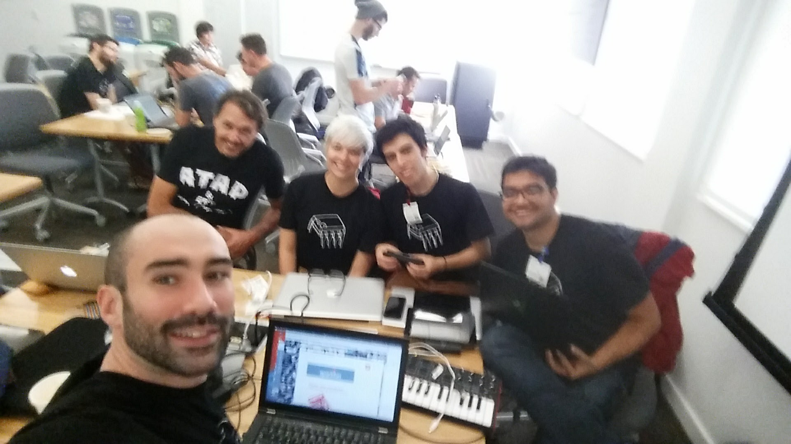
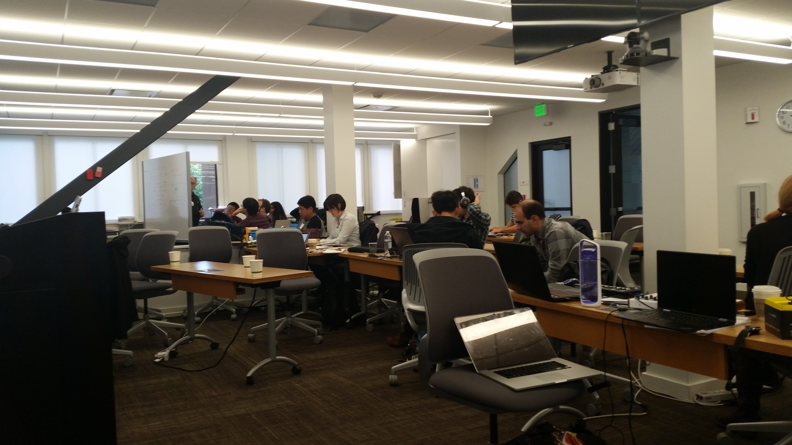

# Google MIDI Hackathon

The Google MIDI Hackathon took place at the Google MTV campus on Oct. 28/29, 2016. Our team made an unnamed instrument that can best be described as an "Android mobile phone augmented as a Kalimba sounding like Christmas bells", fruit of the "yes and" design thinking approach.

The physical interface of our instrument was made with a [Teensy](https://www.pjrc.com/teensy/) board and uses capacitive touch sensing. Sounds are generated using a modal physical model implemented in [Faust](http://faust.grame.fr). [faust2api](https://ccrma.stanford.edu/~rmichon/faust2api/) was used to make the audio portion of the app. 

The code you will find in this repository is EXTREMELY dirty and it is likely that this app will crash if you run it on your phone :). If you don't believe that it is actually working, check the demo video in `picts/1.mp4`.

## Acknowledgements

We thank Google for organizing this event, it was so much fun! Special thanks to Glenn Kasten and Hongchan Choi for inviting us!

## Pictures

## Licence

This code is freely available under the [Apache Licence 2.0](http://www.apache.org/licenses/LICENSE-2.0).